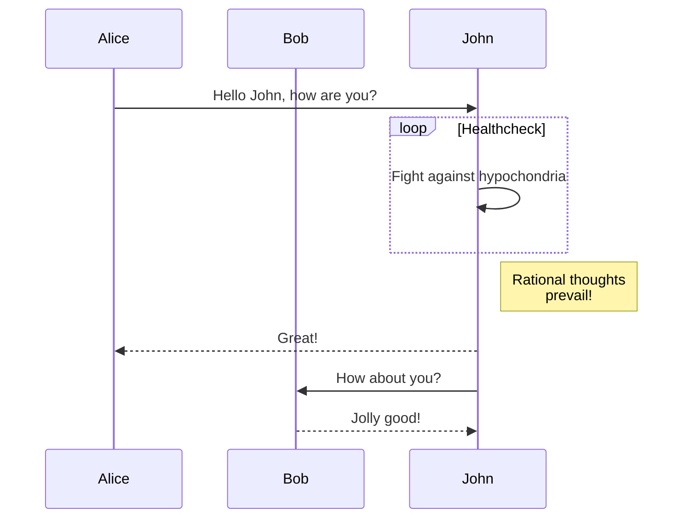
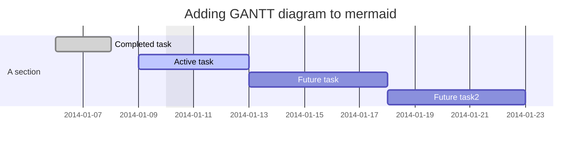
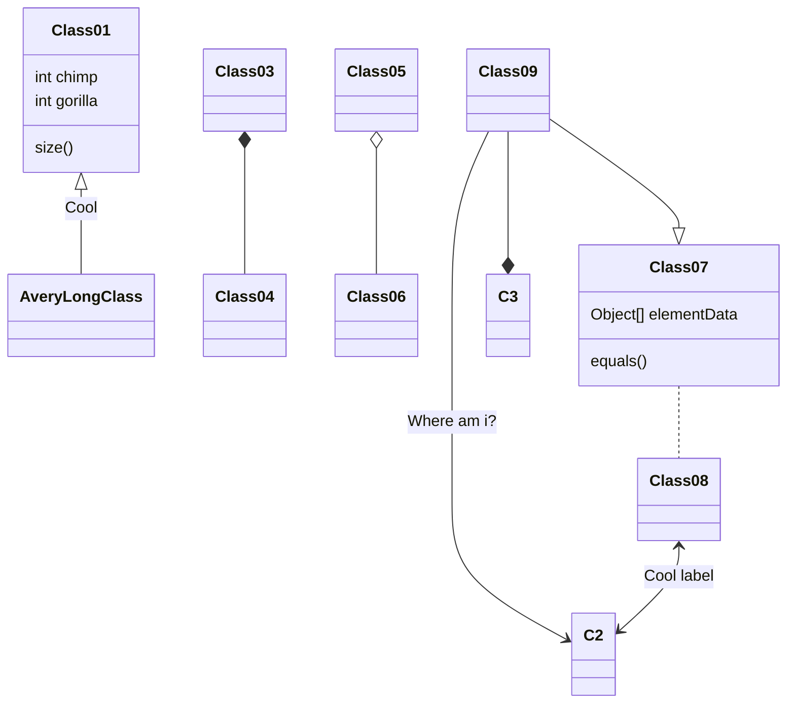
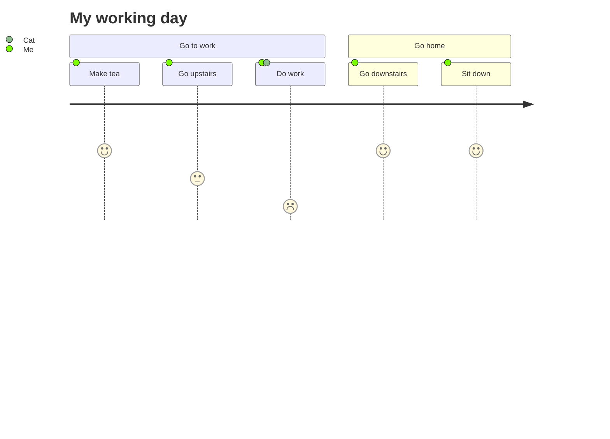
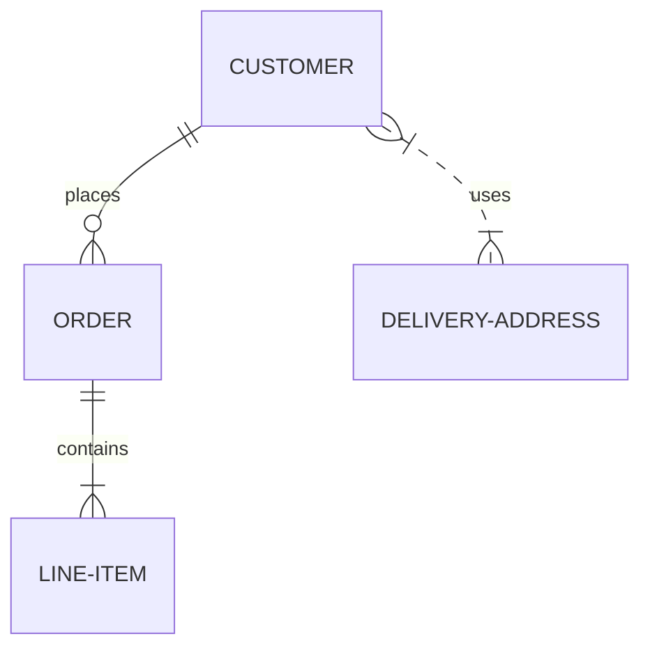

$$
$$

For example:

$$
f(x) = \int_{-\infty}^\infty
	\hat f(\xi)\,e^{2 \pi i \xi x}
	\,d\xi
$$


$$\hat{y} = \sigma(w^{T}x+b) = \frac{1}{1+e^{-w^{T}x+b}}$$
    $$cost = \frac{-1}{m} \cdot \sum_{i=o}^{m} [y \cdot log(\hat{y}) + (1 - y)log(1-\hat{y})]$$













silly cat image


</div>

# Heading 1
## Heading 2
## Heading 3

**bold text**
*italic text*
>Josh: What button do we pwess?
>Me: Nothing yet son...
>Neep: This is too easy sensei! 
Unordered List(-,*,+):
* Bacon
* Eggs
* Cheese
* Tortillas
* Juice

Ordered List:
1. Title
2. Table of Contents
   1. recognition
   2. thank you message
3. Chapter 1
4. Etc.

Inline code 	

This is `someJavaScript()`

Code block 	

Here's some JavaScript code:

```
function hello() {
    alert('hello');
}
```

Language is normally auto-detected,
but it can also be specified:

```sql
SELECT * FROM users;
DELETE FROM sessions;
```

Horizontal Rule 	
---
One rule:
***
Another rule:
___

<https://eff.org>
2
<fake@example.com>


Link, you can find original text here: [Simple MD Documentation](https://joplinapp.org/markdown/#math-notation)
---
This is detected as a link:

https://joplinapp.org

And this is a link anchoring text content:

[Joplin](https://joplinapp.org)

And this is a link, with a title,
anchoring text content:

[Joplin](https://joplinapp.org "Joplin project page")


Images 	


Tables🔗

Tables are created using pipes | and hyphens -. This is a Markdown table:

| First Header  | Second Header |
| ------------- | ------------- |
| Content Cell  | Content Cell  |
| Content Cell  | Content Cell  |

Checkboxes🔗

Checkboxes can be added like so:

- [ ] Milk
- [x] Rice
- [ ] Eggs

This is <s>strikethrough text</s> mixed with regular **Markdown**.
==marked==

Simples inline footnote ^[I'm inline!]


I really like using Markdown.

I think I'll use it from now on.